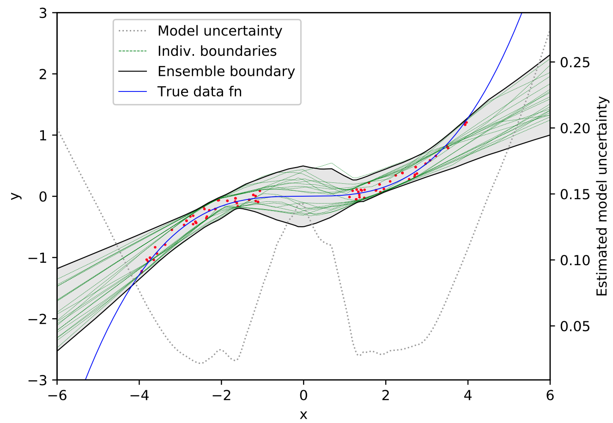

# High-Quality Prediction Intervals for Deep Learning

Code accompanying the paper High-Quality Prediction Intervals for Deep Learning: A Distribution-Free, Ensembled Approach [https://arxiv.org/abs/1802.07167](https://arxiv.org/abs/1802.07167).

## Intro

How can we get uncertainty estimates from deep learning systems? 

 Estimating model uncertainty. 

 Comparison against MVE.

## Jupyter Notebook Keras Demo

A simple fast demo using Keras is included in [QD_AsFastAsPoss_notebook.ipynb](QD_AsFastAsPoss_notebook.ipynb).

## Code Structure

Main paper code in 5 files:

* main.py
* pso.py
* DataGen.py
* DeepNetPI.py
* utils.py
* inputs.txt

Run main.py to reproduce first figure.

We have included inputs used for the boston and concrete datasets in inputs.txt.

